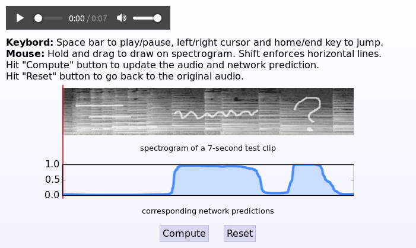

Fooling Singing Voice Detection CNNs with Hand-Drawn Examples
=============================================================

For the presentation of my ISMIR 2016 paper titled "Learning to Pinpoint
Singing Voice from Weakly-Labeled Examples"
[[Paper](http://ofai.at/~jan.schlueter/pubs/2016_ismir.pdf),
 [BibTeX](http://ofai.at/~jan.schlueter/pubs/2016_ismir.bib)], I put together
a small web demo showing how a state-of-the-art singing voice detector seems
to only rely on detecting sloped or wiggly lines in the spectrogram.

The web demo allows you to draw into a mel spectrogram of a piano recording,
compute singing voice predictions with a CNN, and also listen to what you drew:



It is currently available online at https://jobim.ofai.at/singinghorse (the
first computation might take quite a while, in case it has to reload Theano
and recompile the function, others will take less than a second).

The code and model in this repository allows you to run the demo locally on
your machine instead, or take a look at how it's done. Feel free to copy out
bits and pieces, but make sure to obey and include the [license](./LICENSE).

For the baseline experiments of my ISMIR 2015 paper, see the
[`ismir2015`](//github.com/f0k/ismir2015) repository, and for experiments on
training a network to not be irritated by wiggly lines, see its
[`unhorse`](//github.com/f0k/ismir2015/tree/unhorse) branch.


Preliminaries
-------------

Running the code locally requires the following software:
* Python 2.7+ or 3.4+
* Python packages: numpy, scipy, matplotlib, h5py
* ffmpeg or avconv

For better performance, the following Python packages are recommended:
* Theano, Lasagne (for much faster network predictions)
* pyfftw (for much faster spectrogram computation)
* bjoern (for a more stable web server)

For Theano and Lasagne, you may need the bleeding-edge versions from github.
In short, they can be installed with:
```bash
pip install --upgrade --no-deps https://github.com/Theano/Theano/archive/master.zip
pip install --upgrade --no-deps https://github.com/Lasagne/Lasagne/archive/master.zip
```
(Add `--user` to install in your home directory, or `sudo` to install globally.)
For more complete installation instructions including GPU setup, please refer
to the [From Zero to Lasagne](https://github.com/Lasagne/Lasagne/wiki/From-Zero-to-Lasagne)
guides.

On Ubuntu, pyfftw can be installed with the following two commands:
```bash
sudo apt-get install libfftw3-dev
pip install pyfftw
```

Finally, bjoern is available on PyPI:
```bash
pip install bjoern
```
(Again, optionally add `--user` or `sudo`.)


Running
-------

Clone the repository somewhere:
```bash
git clone https://github.com/f0k/singing_horse.git
```
If you do not have `git` available, download the code from
https://github.com/f0k/singing_horse/archive/master.zip and extract it.

Run the built-in web server with:
```bash
python serve.py
```
You should now be able to access it at http://localhost:9090.

Alternatively, under Apache, activate mod_wsgi and add a `WSGIScriptAlias`
directive mapping some URL to `serve.py`.


About...
--------

### ... the implementation

The spectrogram `` is overlaid with a same-sized `<canvas>` element that
is semi-transparent. Mouse movements are translated to line drawings with some
minimal JavaScript. Clicking the "Compute" button uploads the line drawing as
a PNG [data URI](https://en.wikipedia.org/wiki/Data_URI_scheme) to the web
server, via a POST request to `/render`. In `serve.py`, this URI is decoded to
binary, then decoded to a numpy array with the Python Imaging Library (PIL).
It is combined with the (precomputed) spectrogram of the test audio snippet,
and passed to the CNN in `predict.py`. The resulting prediction curve is
rendered to an in-memory PNG with matplotlib in `plot.py`. Furthermore, the
combined spectrogram is resynthesized to audio samples in `spects.py`, and
then encoded to an in-memory MP3 file with `ffmpeg`. Finally, the MP3 file and
PNG are encoded as data URIs and sent back to the browser, which updates the
`` and `<audio>` sources with the data URIs. (The data is small enough
for data URIs, and sending it directly to the client in this way avoids having
to store and manage temporary image and audio files on the server.)

### ... the code

The code was thrown together for the demonstration in my ISMIR 2016
presentation, and is not fully-polished and fully-documented. I am publishing
it because several people asked how this was done, and I hope it still serves
to explain this. Feel free to open an issue here or send me an email if you
have any questions. If you reuse parts of the code for your purposes, please
make sure to include the [license](./LICENSE).
